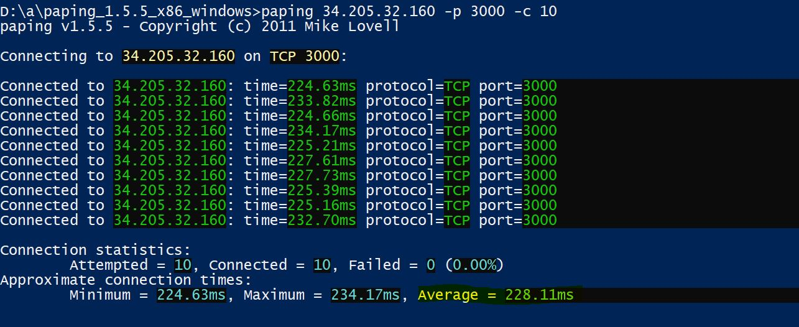

# Cách kết nối vào máy amazonaws bằng PuTTY

https://docs.aws.amazon.com/en_us/AWSEC2/latest/UserGuide/putty.html

# Kiểm tra cổng TCP, mô phỏng chức năng của ping
## Công cụ
https://code.google.com/archive/p/paping/

```paping v1.5.5 - Copyright (c) 2011 Mike Lovell

Syntax: paping [options] destination

Options:
 -?, --help     display usage
 -p, --port N   set TCP port N (required)
     --nocolor  Disable color output
 -t, --timeout  timeout in milliseconds (default 1000)
 -c, --count N  set number of checks to N
 ```
**US East (N. Virginia)**


