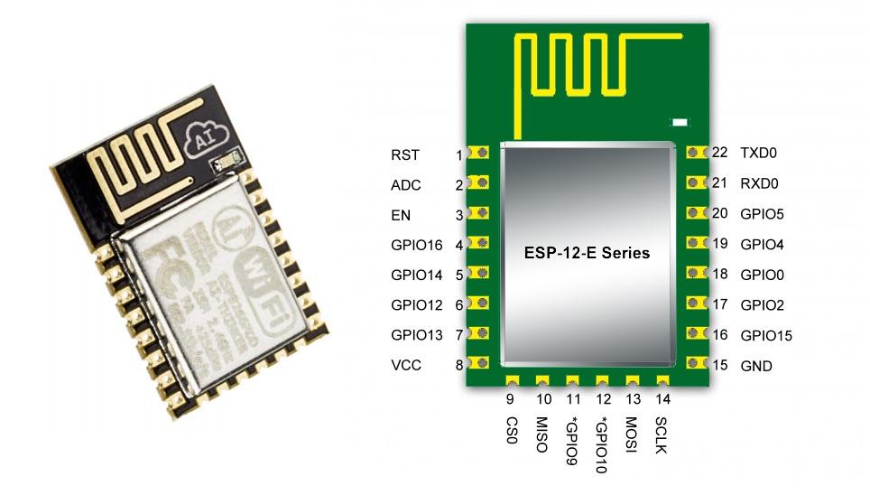

# Client
## ESP8266

### Các loại Module ESP8266

| Phiên bản| Số chân   | pitch  | form factor | LEDs |Antenna|Ant.Socket| Shielded |dài mm | 
|------------|--------|--------|-------------|------|---------------|------------|----------|---------------| 
| ESP-01     | 8      | .1“    | 2×4 DIL     | Yes  | Etched-on PCB | No         | No       | 14.3 x 24.8   | 
| ESP-02     | 8      | .1”    | 2×4 notch   | No?  | None          | Yes        | No       | 14.2 x 14.2   | 
| ESP-03     | 14     | 2mm    | 2×7 notch   | No   | Ceramic       | No         | No       | 17.3 x 12.1   | 
| ESP-04     | 14     | 2mm    | 2×4 notch   | No?  | None          | No         | No       | 14.7 x 12.1   | 
| ESP-05     | 5      | .1“    | 1×5 SIL     | No   | None          | Yes        | No       | 14.2 x 14.2   | 
| ESP-06     | 12+GND | misc   | 4×3 dice    | No   | None          | No         | Yes      | 16.3 x 13.1   | 
| ESP-07     | 16     | 2mm    | 2×8 pinhole | Yes  | Ceramic       | Yes        | Yes      | 20.0 x 16.0   | 
| ESP-08     | 14     | 2mm    | 2×7 notch   | No   | None          | No         | Yes      | 17.0 x 16.0   | 
| ESP-08 New | 16     | 2mm    | 2×8 notch   | No   | None          | No         | Yes      | 18.0 x 16.0   | 
| ESP-09     | 12+GND | misc   | 4×3 dice    | No   | None          | No         | No       | 10.0 x 10.0   | 
| ESP-10     | 5      | 2mmm?  | 1×5 notch   | No   | None          | No         | No       | 14.2 x 10.0   | 
| ESP-11     | 8      | 1.27mm | 1×8 pinhole | No?  | Ceramic       | No         | No       | 17.3 x 12.1   | 
| ESP-12     | 16     | 2mm    | 2×8 notch   | Yes  | Etched-on PCB | No         | Yes      | 24.0 x 16.0   | 
| ESP-12-E   | 22     | 2mm    | 2×8 notch   | Yes  | Etched-on PCB | No         | Yes      | 24.0 x 16.0   | 
| ESP-13     | 18     | 1.5mm  | 2×9         | ?    | Etched-on PCB | No         | Yes      | ? x ?         | 
| ESP-14     | 22     | 2mm    | 2×8 + 6     | 1    | Etched-on PCB | No         | Yes      | 24.3 x 16.2   | 
| WROOM-02   | 18     | 1.5mm  | 2×9         | No   | Etched on PCB | No         | Yes      | 20.0 x 18.0   | 
| WT8266-S1  | 18     | 1.5mm  | 3×6         | 1    | Etched on PCB | No         | Yes      | 15.0 x 18.6   | 

### ESP8266 

* Đây là một [SoC](https://en.wikipedia.org/wiki/System_on_a_chip) không dây 
* Nó có GPIO, I2C, ADC, SPI, PWM
* CPU default is in 80MHz, max can be 160MHz
* Its based on the RISC architecture

### Tính năng

* Tiêu chuẩn wifi : 802.11b/g/n, với tần số 2.4GHz,và hổ trợ bảo mật WPA/WPA2
* Mạch nhỏ, gọn (24.75mm x 14.5mm)
* Tích hợp 10-bit ADC
* Tích hợp giao thức TCP/IP (hiện tại thời điểm này hỗ trợ ipv4)
* Tích hợp năng lượng thấp 32-bit MCU
* SDIO 2.0, SPI, UART, [I2C](Drivers)
* STBC, 1x1 MIMO, 2x1 MIMO
* Điện áp làm việc 3.3v
* Có các chế độ: AP, STA, AT + STA
* Bộ nhớ Flash: 4MB
* Lệnh AT rất đơn giản, dễ dàng sử dụng
* Lập trình trên các ngôn ngữ: C/C++, Micropython, NodeMCU - Lua

## ESP8266 AT
* ESP8266 kết nối với MCU khác bằng UART
* MCU gửi AT + CMD thông qua UART để điều khiển ESP8266

### Tập lệnh AT Command
AT						Kiểm tra lệnh, luôn trả về "OK" 			 	`AT`
AT+RST					Khởi động lại module	 						`AT+RST`
AT+GMR					Truy vấn phiên bản Firmware 	 				`AT+GMR`

AT+CWMODE = <mode>		Cài đặt chế độ	1 = Station 2 = Access Point  3 = Both							`AT+CWMODE=1`
AT+CWMODE?				Truy vấn chế độ đã cài đặt	 													`AT+CWMODE?`
AT+CWMODE =?			Truy vấn các chế độ có thể cài đặt	 											`AT+CWMODE=?`
AT+CIPMUX = <mode>		Cài đặt số lượng các kênh kết nối	0 = 1 kênh kết nối 1 = Nhiều kênh kết nối	`AT+CIPMUX=1`
AT+CIPMODE = <mode>		Cài đặt chế độ dữ liệu	0 = transparent  1 = Data								`AT+CIPMODE=1`
AT+CIPMODE?				Truy vấn chế độ dữ liệu cài đặt	 												`AT+CIPMODE?`

AT+CWJAP = <ssid>, <password>		Kêt nối với 1 mạng wifi	SSID và password     `AT+CWJAP = "abc", "5678"`
AT+CWJAP?	Truy vấn mạng wifi đang kết nối	 			`AT+CWJAP?`
AT+CWLAP	Truy vấn các mạng wifi có thể kết nối	 	`AT+CWLAP`
AT+CWQAP	Đóng kế nối wifi với một Access Point	 	`AT+ CWQAP`
AT+CIFSR	Xem địa chỉ IP của module	 				`AT+CIFSR`