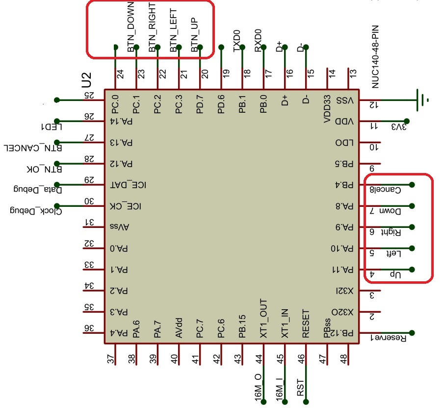

# Code tay cầm

| Chức năng| 		GPIO   | 
|------------|--------|
| LED1     | PA.14     |  
| LED2     | PA.15      |  
|BTN_OK      | PA.12     |  
|BTN_CANCEL      |PA.13      | 
| BTN_LEFT     | PC.3 |
|BTN_RIGHT    | PC.2     | 
| BTN_UP     | PD.7     | 
| BTN_DOWN  | PC.1     | 
|BTN_1     |  RESET NUC |
|VIBRATE     |PC.0 |

